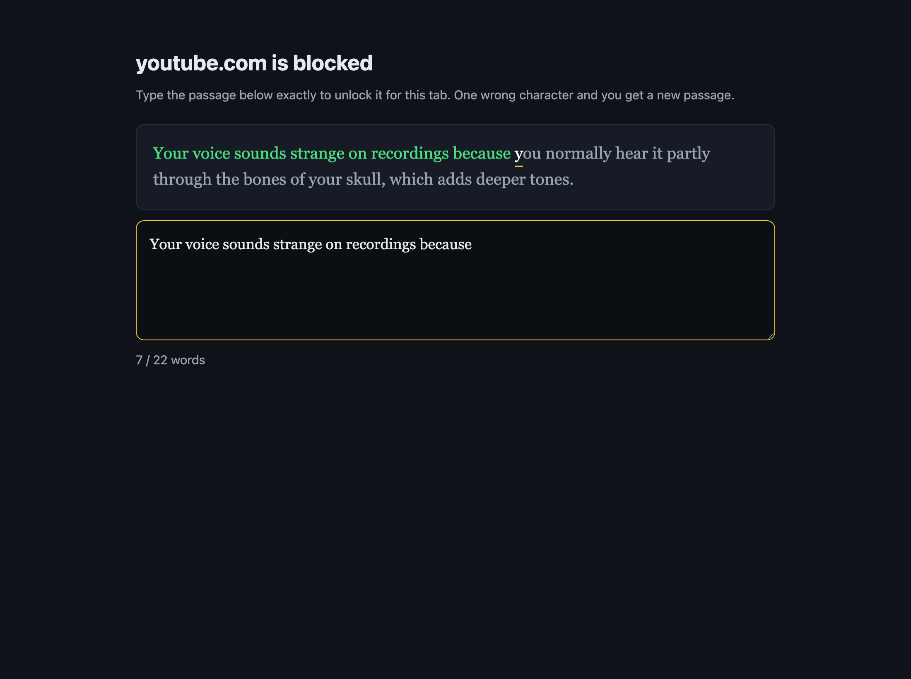
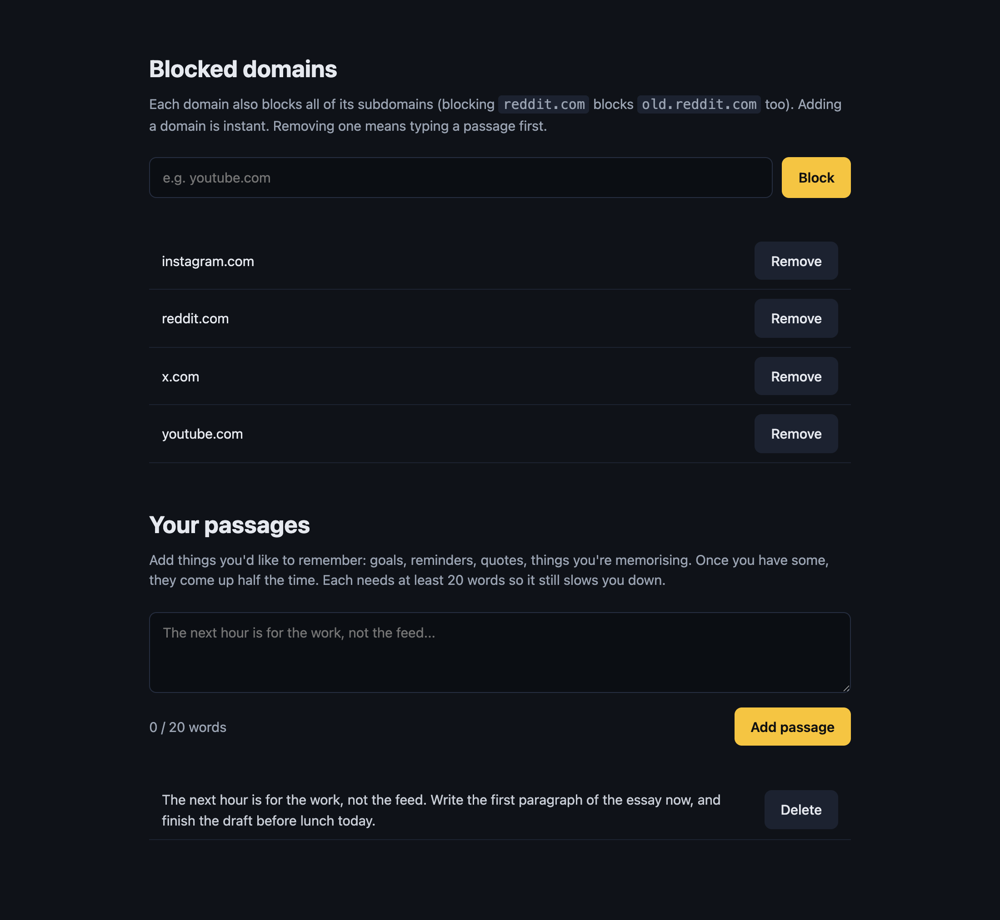

<p align="center">
  
</p>

<h1 align="center">Typewall</h1>

<p align="center">
  A Chrome extension that puts a wall in front of distracting sites.<br>
  The only way through is to type a short passage, perfectly, and learn something on the way.
</p>

---

Most site blockers are easy to get past. You click "just five minutes" and you're back on the site. Typewall adds friction that takes real effort. To open a blocked site, you retype a random passage of about 25 words exactly. Make one typo and the input is cleared and you get a new passage.

Each passage teaches you something: a surprising fact, a mental model, a useful life skill, or why something works the way it does. You can also add your own passages, such as goals, reminders, or things you're memorising. Even if you go through to the site, you learn something first.

<p align="center">
  
</p>

## Features

- **Blocks a domain and all its subdomains.** Blocking `reddit.com` also blocks `old.reddit.com`.
- **100 passages worth typing**, about 25 words each, picked at random. There are 25 each of general knowledge, mental models, life skills, and why things are the way they are.
- **Your own passages.** Add goals, reminders, or things you're memorising on the settings page. Once you have some, they come up half the time. Each one needs at least 20 words.
- **One mistake and you start over.** The first wrong character clears the input and swaps in a new passage.
- **No shortcuts.** Paste, drag-and-drop, backspace and autocorrect are disabled. The passage is drawn on a canvas, so you can't select or copy it.
- **Unlocks one tab only.** Unlocking a site lets you use it in that tab until the tab closes. Other tabs stay blocked, and restarting Chrome locks everything again.
- **Removing a site is also locked.** Adding a site is instant. Removing one from the list means typing a passage first.
- **Private.** No accounts, no servers, no analytics. Your blocklist and passages are kept in `chrome.storage.local`.

<p align="center">
  
</p>

## Install

Typewall isn't on the Chrome Web Store yet. To load it from source:

1. Clone this repo: `git clone https://github.com/iBala/typewall.git`
2. Open `chrome://extensions` and turn on **Developer mode**.
3. Click **Load unpacked** and select the `extension/` folder.
4. Click the Typewall icon in the toolbar to add domains to block.

To use Typewall in incognito windows, open the extension's details page and turn on **Allow in Incognito**.

## How it works

- A single [`declarativeNetRequest`](https://developer.chrome.com/docs/extensions/reference/api/declarativeNetRequest) dynamic rule redirects top-level navigations to blocked domains to `blocked.html`. The original URL is kept so you land where you were going after you unlock.
- An unlock adds a higher-priority session `allow` rule for that domain in that tab only. The rule is removed when the tab closes, and Chrome clears all session rules on restart.
- Typing is checked on every keystroke against the target passage. Only plain `insertText` input is accepted.

```
extension/
  manifest.json   MV3 manifest
  background.js   service worker: block rule, per-tab unlock rules
  challenge.js    canvas-rendered typing challenge
  passages.js     the 100 passages
  blocked.html/js block page
  options.html/js manage the blocklist and your passages
```

## Honest limitations

Typewall adds friction. It is not a lock. You can always disable or remove an extension at `chrome://extensions`, and a determined developer can get past it with DevTools. It works best as a pause between the urge to open a site and actually opening it.

## Contributing

Issues and PRs are welcome. Passages are a good place to start. A new passage should be about 21 to 27 words, teach something accurate, and use only letters, spaces, commas, periods and straight apostrophes. Write numbers out as words.

## License

[MIT](LICENSE)
